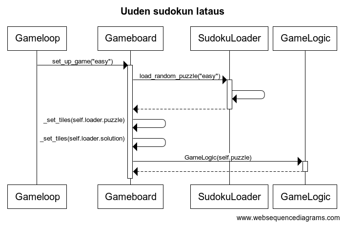
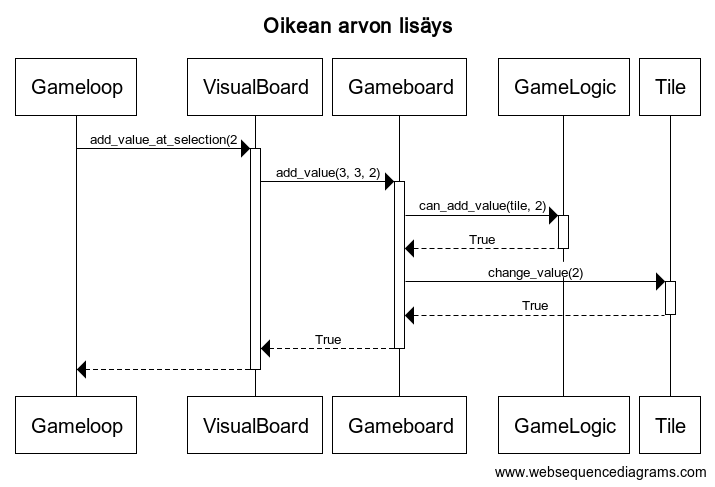
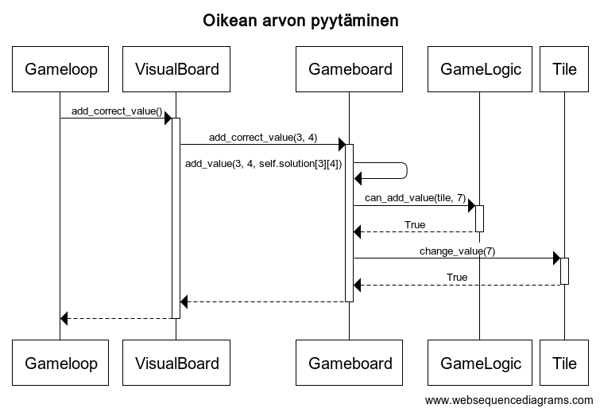

# Arkkitehtuurikuvaus

## Ohjelman rakenne


- ui: käyttöliittymä
- gamelogic: pelilogiikka
- repositories: valmiiden pelien ja keskeneräisten pelien tallennus
- entities: ohjelman käyttämiä luokkia

## Toiminnallisuuksia

### Käyttöliittymä

Ohjelma sisältää kahdenlaisia näkymiä - valikoita ja peliruudun. Kaikissa näkymissä voi navigoida hiirellä ja/tai näppäimistöllä.

Valikoita on kolme erilaista:
- Aloitusvalikko
- Kesken pelin -valikko
- Voitetun pelin jälkeinen valikko

Pelaajalle näkyvät toiminnallisuudet on eriytetty itse sovelluslogiikkaa pyörittävistä ominaisuuksista.

### Tietojen tallennus

Tietoja tallennetaan SQLite-tietokantaan, joka pitää sisällään oletusarvoisesti 100 erilaista sudokua jokaista neljää vaikeusastetta kohden. Sudokujen tiedot säilytetään .csv-tiedostossa, josta alustetaan ensimmäisen käytön yhteydessä tietokanta.

Yksittäinen sudoku-peli on .csv-muotoinen, esimerkiksi
```
12...98.67....6.35.8....2.7...67.9......5.........8...3..2..7...9....6.8.....1...,125739846749826135683514297512673984978452361436198572364285719291347658857961423,easy
```
Ensimmäinen tietue on pelin alkuasetelma, toinen tietue on pelin ratkaisu kolmas tietue kyseisen pelin vaikeusaste. Numerot luetaan rivi riviltä, vasemmalta oikealle täyttäen. Sudokut on generoitu käyttäen sivustoa https://qqwing.com/generate.html

Käyttäjä voi halutessaan lisätä [csv-tiedostoon](../src/data/sudokus.csv) uusia rivejä. Tiedostosta voi luonnollisesti myös poistaa rivejä, mutta sovellus ei osaa ottaa huomioon kaikkia mahdollisia virhetilanteita, jotka voivat syntyä rivien poistamisesta - tästä tarkemmin tämän dokumentin loppupuolella.

## Päätoiminnallisuudet

### Pelin aloittaminen

Aloitus vie pelaajan päävalikkoon. Täällä pelaaja voi valita vaikeusasteen ja aloittaa uuden pelin, tai hän voi ladata edellisen tallennetun pelin ja jatkaa siitä. Jos edellistä peliä ei ole tallennettu, pelaajalle alustetaan uusi helppo sudoku.

Alla olevassa sekvenssikaaviossa on esitetty ohjelman toiminta, kun pelaaja on valinnut päävalikosta vaikeusasteen "Heleppo" ja painanut Aloita:


Gameloop pyytää Gameboard-oliota lataamaan uuden pelin menussa valitulla vaikeusasteella. Gameboard puolestaan pyytää SudokuLoader-oliotaan tekemään satunnaisen pelin latauksen. SudokuLoader tekee tietokantakyselyn parametrina sille annettu vaikeusaste. Saatujen tuloksien joukosta se arpoo yhden sudokun, jonka arvot se asettaa omiin oliomuuttujiinsa. Kun suoritus palaa Gameboard-oliolle, hakee se omalle pelialueelleen SudokuLoaderiin ladatut pelin ja ratkaisun. Tämän jälkeen Gameboard alustaa vielä pelin sääntöjä seuraavan GameLogic-olion, jolle viedään pelin ruudut.

### Pelin pelaaminen

Pelialueella voi liikkua hiirellä tai nuolinäppäimillä. Numerot pitää syöttää näppäimistöllä - numerorivi tai numpad käyvät kumpikin. Peli menee valikkoon escape-näppäimellä, tai hiiren kakkospainikkeella.

Alla olevassa sekvenssikaaviossa kuvataan ohjelman toimintalogiikka, kun käyttäjä yrittää lisätä valittuu ruutuun numeron.

Kun käyttäjä lisää sudokun keskimmäisen 3x3 ruudukon vasempaan ylänurkkaan arvon kaksi, joka on sääntöjen mukainen lisäys:


Gameloop-luokka tunnistaa käyttäjän antaman komennon ja kutsuu nykyisen valinnan sijainnin tietävää VisualBoard-luokkaa. VisualBoard puolestaan ilmoittaa oikeat koordinaatit Gameboard-luokalle, joka löytää omasta oliomuuttujastaan, mitä yksittäistä ruutua ollaan editoimassa. Tämä yksittäinen ruutu, ja lisättävä arvo, tarkistetaan GameLogic-luokan sääntöjen vastaan. Kun lisäys on pelisääntöjen mukaan hyväksyttävissä, Gameboard kutsuu Tile luokkaa, joka muuttaa ruudun arvon (jos ruutu ei kuulu sudokun aloitusasetelmaan).

Alla olevassa sekvenssikaaviossa kuvataan ohjelman toimintalogiikka, kun käyttäjä on mennyt kesken pelin valikkoon ja valinnut sieltä komennon "Anna oikea numero". Pelaajalla on valittuna sudokun ruutu (3, 4), johon oikea arvo on 7.


Toimintalogiikka on muuten sama kuin edellisessa kaaviossa, mutta Gameboard-olio katsoo omasta ratkaisustaan mikä arvo kyseiseen valintaan pitäisi lisätä.

### Pelin voittaminen

Kun pelialue on täynnä, on peli voitettu. Suorituksenaikainen logiikka varmistaa, että pelialuetta ei ole voinut täyttää virheellisillä arvoilla.

Pelaajalle näytetään voittovalikko, josta pelin voi sulkea, tai voi palata päävalikkoon.

## Ohjelmaan jääneitä puutteita

### Pelien tallentaminen

Päävalikossa näytetään aina mahdollisuus ladata edellinen peli, vaikka sellaista ei olisikaan tallennettuna. Jos pelaaja yrittää avata tallennetun pelin, jota ei ole, alustaa peli hänelle uuden helpon sudokun. Tähän olisi toivottavia parannuksia
- latauspainike ei näy, jos pelejä ei ole
- olemattoman pelin lataaminen antaa virheilmoituksen
- voisi tallentaa useamman pelin ja selailla tallennettuja pelejä valikosta

.csv-tiedostoon tallennettavien sudokujen muokkaaminen ei ole täysin tuettu ominaisuus. Jos käyttäjä poistaa kokonaan jonkin vaikeusasteen, niin sellaisen latauksen yrittäminen kaataa pelin. Tämä on kuitenkin vaatimusmäärittelyyn nähden ylimääräinen ominaisuus.

Sudokujen latausta tietokannasta voisi ylipäätään refaktoroida selkeämmäksi. Tiedon kuljettaminen oliomuuttujien kautta ei ehkä ole maailman elegantein ratkaisu.
