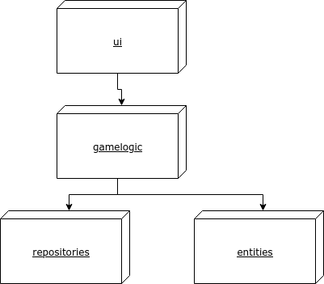

# Arkkitehtuurikuvaus

## Ohjelman rakenne

- ui: käyttöliittymä
- gamelogic: pelilogiikka
- repositories: valmiiden pelien ja keskeneräisten pelien tallennus
- entities: ohjelman käyttämiä luokkia

## Toiminnallisuuksia

### Uuden arvon lisääminen

Alla olevassa sekvenssikaaviossa kuvataan ohjelman toimintalogiikka, kun käyttäjä yrittää lisätä valittuun ruutuun numeron.

Kun käyttäjä lisää sudokun keskimmäisen 3x3 ruudukon vasempaan ylänurkaan arvon kaksi, joka on sääntöjen mukainen lisäys:

Gameloop-luokka tunnistaa käyttäjän antaman komennon ja kutsuu nykyisen valinnan sijainnin tietävää VisualBoard-luokkaa. VisualBoard puolestaan ilmoittaa oikeat koordinaatit Gameboard-luokalle, joka löytää omasta oliomuuttujastaan, mitä yksittäistä ruutua ollaan editoimassa. Tämä yksittäinen ruutu, ja lisättävä arvo, tarkistetaan GameLogic-luokan sääntöjen vastaan. Kun lisäys on pelisääntöjen mukaan hyväksyttävissä, Gameboard kutsuu Tile luokkaa, joka muuttaa ruudun arvon (jos ruutu ei kuulu sudokun aloitusasetelmaan).
