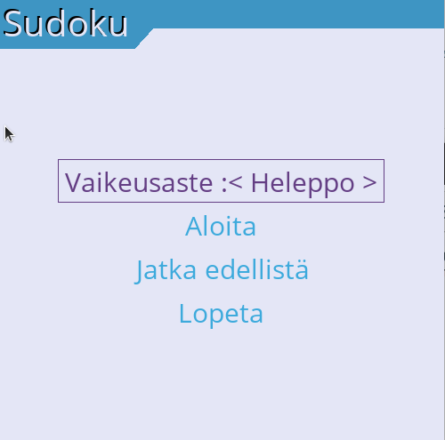
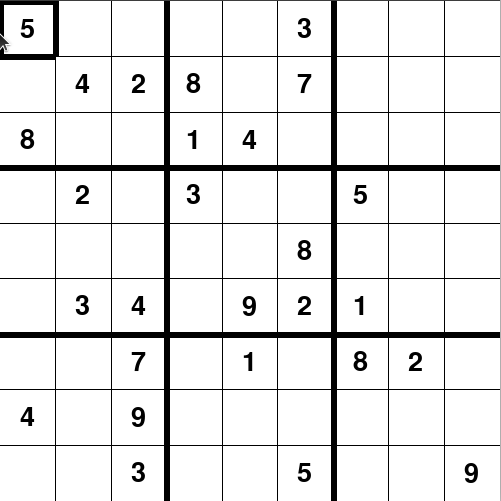
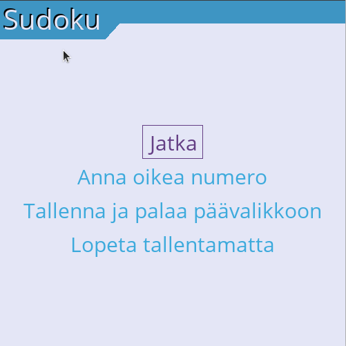

# Sudoku-ohjelman käyttöohje

Ohjelman viimeisimmän julkaistun version löydät [täältä](https://github.com/Aikamoine/ot-harjoitustyo/releases).

## Asennus ja käynnistys

- Asenna ennen ensimmäistä käyttöä Poetryn avulla riippuvuudet komentorivillä:
```bash
poetry install
```

- Käynnistä ohjelma komennolla:
```bash
poetry run invoke start
```

## [Sudokun säännöt](https://fi.wikipedia.org/wiki/Sudoku)

"Sudoku on logiikkapeli, jossa tehtävänä on täyttää neliönmuotoinen ruudukko merkeillä niin että jokaisella vaakarivillä ja pystyrivillä sekä jokaisessa osaneliössä käytetään samaa merkkiä tasan yhden kerran. Ruudukossa on aluksi valmiina jo muutama merkki. Yleisin sudoku on 9 × 9 -ruudukko, joka on jaettu yhdeksään 3 × 3 ruudun osaneliöön, ja merkkeinä käytetään numeroita 1–9."

## Pelaaminen

Pelin käynnistyessä aukeaa päävalikko:



Täällä voit valita pelin vaikeusasteen, aloittaa valitun vaikeusasteen pelin, ladata aiemmin tallennetun pelin, tai sulkea ohjelman. Jos aikaisempaa peliä ei löydy tallennettuna, niin "Jatka edellistä" valinta alustaa uuden heleppo-tasoisen sudokun.

Kaikissa pelin valikoissa voit liikkua hiirellä tai nuolilla. Valitseminen onnistuu hiiren ykköspainikkeella tai enter-näppäimellä.

Pelin aloittaminen tai lataaminen johtaa peliruudukkoon:



Näet korostettuna aina ruudun, johon arvoa ollaan syöttämässä. Voit valita toisen ruudun nuolinäppäimillä, tai hiiren ykköspainikkeella. Uuden arvon voi syöttää näppäimistön numeroriviltä, tai numpadista. Valitun arvon voi poistaa delete- tai backspace-painikkeella.

Numeron lisääminen onnistuu vain, jos lisäys on sudokun sääntöjen mukainen ja ruudussa ei ole alkuperäiseen asetelmaan kuuluva arvo. Poistaminen onnistuu, jos poistettava arvo ei kuulu sudokun alkuperäiseen asetelmaan.

Pelin aikana pääset menuun painamalla ESC-näppäintä tai hiiren kakkospainiketta:



Jatka-valinnalla pääset takaisin käynnissä olevaan peliin. "Anna oikea numero" -valinta tuo oikeasta ratkaisusta numeron sudokussa valittuna olevaan ruutuun. Jos menet valikkoon hiiren kakkospainikkeella, niin peliruudun valinta siirretään ruutuun, jonka kohdalla aktivoit valikon.

"Tallenna ja palaa päävalikkoon" tekee juuri mitä sen voisi kuvitella tekevän - kuten tekee myös "Lopeta tallentamatta". Huomaa, että sovelluksessa voi olla tallennettuna kerrallaan vain yksi peli - edellisen yli kirjoitetaan armottomasti, jos tallennat sen päälle!

### Voittaminen

Kun saat ruudun täytettyä, aukeaa voittonäkymä, jossa sinua onnitellaan mahtavasta uroteostasi. Tästä näkymästä voit palata päävalikkoon aloittamaan uutta peliä, tai sulkea pelin.

Missä tahansa vaiheessa voit sammuttaa oikean yläreunan ruksista.

## Uusien sudokujen lisääminen

Jos haluat lisätä peliin uusia sudokuja, niin voit tuoda uusia rivejä sudokus.csv-tiedostoon. Tiedoston sijainti on oletusarvoisesti src/data/sudokus.csv.

Kun olet lisännyt rivin, pitää pelin tietokanta alustaa uudestaan. Tämä onnistuu joko varmistamalla, että tietokanta-tiedostoa ei ole (oletusarvoisesti src/data/sudokus.db), tai sitten ajamalla komentoriviltä:

```bash
poetry run invoke initialize
```

Voit generoida uusia valmiiksi oikeassa muodossa olevia sudokuja osoitteessa https://qqwing.com/generate.html.

Voit myös lisätä oman sudokun jäljittelemällä muita sudokus.csv-tiedostosta. Ensimmäinen tietue on sudokun alkuasetelma rivi riviltä, vasemmalta oikealle, ylhäältä alas. Tyhjät ruudut merkitään pisteinä. Toinen tietue on sudokun ratkaisu samaan tapaan. Kolmas tietue on vaikeusaste, jonka pitää olla yksi vaihtoehdoista "easy", "medium, "hard" tai "pro".

