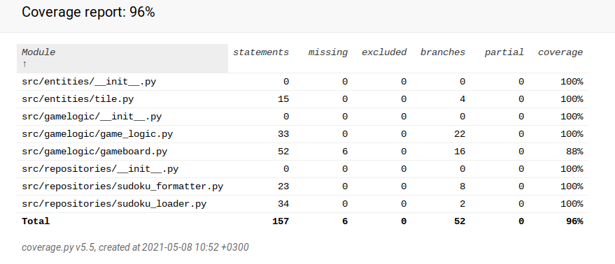

# Testausdokumentaatio - Sudoku-harjoitustyö

Ohjelman testauksessa on käytetty unittest-yksikkötestejä ja tutkivaa järjestelmätason käyttäjätestausta.

## Sovelluslogiikan testaus

### Sovelluksen yksikkötestit

Yksikkötestauksessa testit on jaettu neljään luokkaan:
 - pelilogiikan testit
 - sudokujen tiedostomuotojen muutosten testit
 - sudokujen tallentamisen ja lataamisen testit
 - sudokuruudun luokan testit
 
[Pelilogiikan testit](https://github.com/Aikamoine/ot-harjoitustyo/blob/master/src/tests/logic_test.py)
 
Pelilogiikan testit tarkistavat, että pelilaudan luokka pitää käynnissä olevan pelin tiedot muistissa oikein. Samoin testataan, että pelilaudalle tehdyt muutokset ja lisäykset toimivat sääntöjen mukaan, eikä esimerkiksi sudokun alkuasetelmaan kuuluvia ruutuja voi poistaa.

Testauksessa käytetään tietokantakyselyjä tekevän SudokuLoader-luokan sijaan testejä varten tehtyä FakeLoader-luokkaa, joka injektoidaan pelilaudan oliolle.
 
[Tiedostomuotojen muokkauksen testit](https://github.com/Aikamoine/ot-harjoitustyo/blob/master/src/tests/formatter_test.py)
 
Nämä testit varmistavat, että SudokuFormatter-luokka toimii halutulla tavalla. Syötteet ovat suoraan testiluokissa tehtyjä oliota, jotka vastaavat pelin suorituksessa annettuja arvoja.

[Tallentamisen ja lataamisen testit](https://github.com/Aikamoine/ot-harjoitustyo/blob/master/src/tests/loader_test.py)

Tietokantaoperaatioita testataan TestLoader-luokalla. Nämä testit varmistavat, että tietokannan luominen, sinne tallentaminen, ja sieltä hakeminen, onnistuu. Testit luovat tätä varten oman Sqlite3-tietokannan, joka poistetaan aina testin päätteeksi.

[Sudokuruudun testit](https://github.com/Aikamoine/ot-harjoitustyo/blob/master/src/tests/tile_test.py)
 
Näillä testeillä varmistetaan, että yksittäisen ruudun tiedot omasta tilastaan toimivat pelin edellyttämällä tavalla. Testit ovat yksinkertaisia, ja niissä käytetyt arvot sisältyvät testimetodeihin.

### Testikattavuus

Testikattavuudeksi saatiin 96 %, kun testeissä ei huomioida käyttöliittymän luovaa koodia. Tässä raportissa ei myöskään huomioida pelin alustamistoimenpiteitä, koska niiden toiminta on testattu hyvin kattavasti yksikkötestien ja käyttäjätestauksen yhdistelmällä.

Erikseen testaamatta jätettiin Gameboard-luokassa tallennetun pelin lataustoiminto. Sen tietokantaoperaatiot kuitenkin testataan tallentamisen ja lataamisen testien yhteydessä. Periaatteessa tämäkin haara on siis katettu, vaikka testit eivät siellä kuljekaan.

## Järjestelmätason testaus

Koko sovelluksen järjestelmätestaus on tehty manuaalisena tutkivana testauksena.

### Asennus

Asentamista ja alkuasetuksia on testattu ohjeiden mukaisella tavalla. Testaus on tehty Linux-käyttöjärjestelmällä sekä omalla fuksiläppärillä että Yliopiston virtuaalikoneella.

Testauksella on katettu tilanteet, joissa alkuasetuksia ei ole vielä tehty, ja tilanteessa jossa alkuasetelma on valmiiksi asennettu. Testauksessa ei ole varsinaisesti katettu tilannetta, jossa käyttäjä muuttaisi pelin käyttämiä tiedostoja kahden käyttökerran välillä.

### Sovelluksen toiminta

Kaikki vaatimusmäärittelyssä ja käyttöohjeessa eritellyt ominaisuudet on testattu. Pelinäkymässä on varmistettu kaikilla tavallisen suomalaisen näppäimistön syötteillä, ettei ohjelma reagoi odottamattomalla tavalla syötteisiin.

## Loppujulkaisuun jääneet puutteet

Sovellus on vakaa, eikä siinä ole ilmeisiä puutteita. Sovelluksesta ei ole löytynyt tilannetta, jossa se toimisi ei-toivotulla tavalla, tai kaatuisi.

Testauksen näkökulmasta puutteita ei siis ole. Vaatimusmäärittelyssä ja arkkitehtuurikuvauksessa on listattu sovelluksen toteutuksen puutteita ja jatkokehitysideoita.
